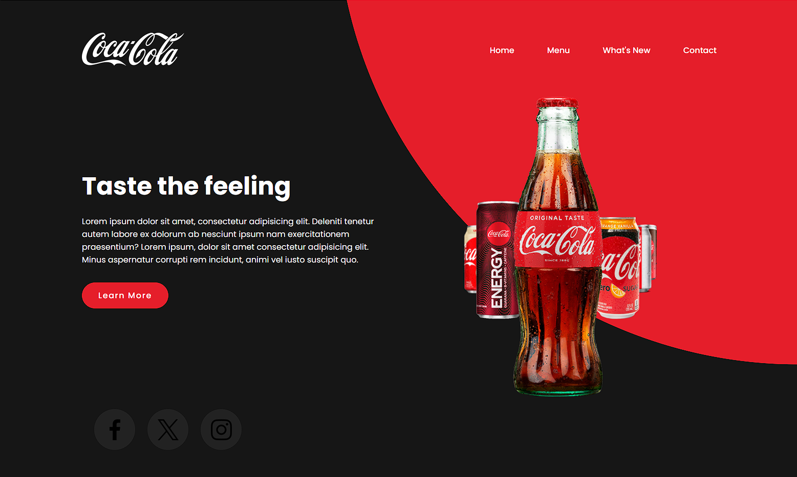
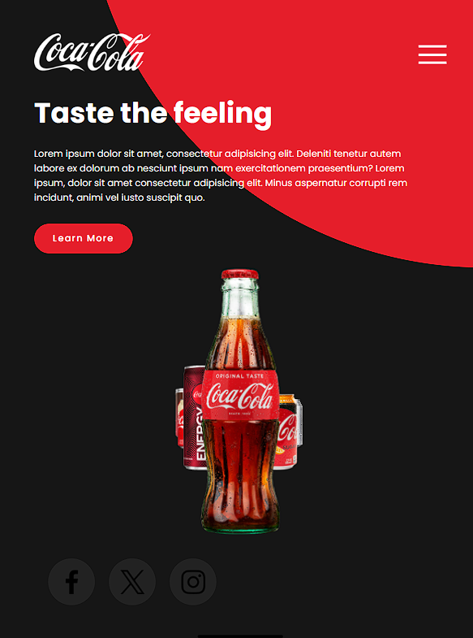
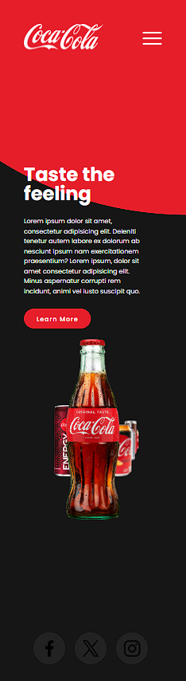

  

  

  

## 🖥️ Projeto

O projeto é um site modelo da coca-cola com a finalidade de estudos.

## 🚀 Tecnologia

Esse projeto foi desenvolvido com as seguintes tecnologias:

- HTML
- CSS
- JAVASCRIPT
- GIT e GITHUB